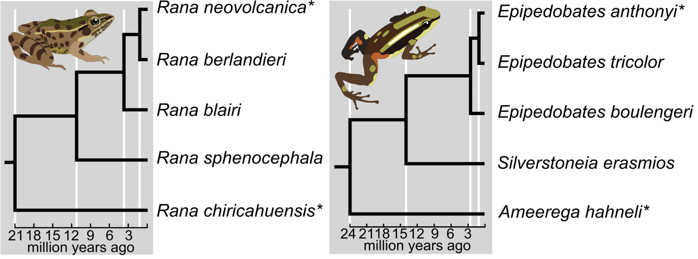

# RADseq phylogenetics in two non-model frog clades

This repository contains code for analyses and data visualizations from:

**Chambers EA, Tarvin RD, Santos JC, Ron SR, Betancourth-Cundar M, Hillis DM, Matz MV, & Cannatella DC. (2023) 2b or not 2b? 2bRAD is an effective alternative to ddRAD for phylogenomics. *Ecology and Evolution*. [https://doi.org/10.1002/ece3.9842](https://onlinelibrary.wiley.com/doi/full/10.1002/ece3.9842)**

This paper compared ddRAD and 2bRAD methods in two groups of frogs. Associated data files, code, and other supplementary materials are available on Dryad [here](https://doi.org/10.5061/dryad.fbg79cnsp) and raw, demultiplexed fastqs are available on SRA (BioProject PRJNA930137). A **full walkthrough** of each analysis, detailing required input files, functions, and outputs, is available [here](https://github.com/eachambers/epi_rana_radseq/blob/master/Detailed_walkthrough.md).

## Code

The following summarizes the contents of this repository.

**I. Post-processing bioinformatics pipelines**
* Concatenate iPyrad output .stats files: [extract_data](https://github.com/eachambers/epi_rana_radseq/blob/master/scripts_data_processing/extract_data.ipynb)
* Transpose 2bRAD output data into Phylip format and calculate replicate loci: [2bRADnative_processdata](https://github.com/eachambers/epi_rana_radseq/blob/master/scripts_data_processing/2bRADnative_processdata.R)
* Calculate depth stats on 2bRAD data: [calculate_depth_stats](https://github.com/eachambers/epi_rana_radseq/blob/master/scripts_data_processing/calculate_depth_stats.R)
* Calculate the average read depth across samples from 2bRAD data: [2bRAD_depth_stats](https://github.com/eachambers/epi_rana_radseq/blob/master/scripts_data_processing/2bRAD_depth_stats.R)
* Process ddRAD data generated using Matz Lab pipeline: [ddRAD_matz_process_data](https://github.com/eachambers/epi_rana_radseq/blob/master/scripts_data_processing/ddRAD_matz_process_data.R)
* Process both 2bRAD and ddRAD clustering threshold data: [clust_threshold_processing](https://github.com/eachambers/epi_rana_radseq/blob/master/scripts_data_processing/clust_threshold_processing.R)

**II. Data visualization**
* Data characterization based on clustering threshold: [Fig. 3](https://github.com/eachambers/epi_rana_radseq/blob/master/scripts_data_visualization/Fig3_Data_characterization.R)
* Read depth and missing data: [Fig. 4](https://github.com/eachambers/epi_rana_radseq/blob/master/scripts_data_visualization/Fig4_read_depth.R)
* Parsimony-informative sites and retention indices: [Fig. 6](https://github.com/eachambers/epi_rana_radseq/blob/master/scripts_data_visualization/Fig6_Retention_index.R)
* Proportions of missing data: [Figs. 7 & S1](https://github.com/eachambers/epi_rana_radseq/blob/master/scripts_data_visualization/Fig7&S1_PAUP_analysis.R)
* Calculating missing data: [Fig. 8](https://github.com/eachambers/epi_rana_radseq/blob/master/scripts_data_visualization/Fig8_Missing_data.R)
* Proportions of state changes from recoded datasets: [Fig. 9](https://github.com/eachambers/epi_rana_radseq/blob/master/scripts_data_visualization/Fig9_Dollo_analysis.R)
* Phylogenetic information along a tree: [Fig. 10](https://github.com/eachambers/epi_rana_radseq/blob/master/scripts_data_visualization/Fig10_Recoded_significance_analysis.R)
* Split iPyrad output .loci files: [Fig. 11, step a](https://github.com/eachambers/epi_rana_radseq/blob/master/scripts_data_visualization/Fig11_a_Split_loci_files.ipynb)
* Calculate shared loci between replicate samples: [Fig. 11, step b](https://github.com/eachambers/epi_rana_radseq/blob/master/scripts_data_visualization/Fig11_b_Shared_loci_replicates.ipynb)
* Construct [Fig. 11](https://github.com/eachambers/epi_rana_radseq/blob/master/scripts_data_visualization/Fig11_c_Shared_loci_replicates.R)

**III. Associated files (for input into above scripts)**
* [Depth stats for 2bRAD data](https://github.com/eachambers/epi_rana_radseq/tree/master/data_files_input_into_scripts/2brad_depth.txt)
* [Read depth data and proportions of missing data (Figs. 4, 8)](https://github.com/eachambers/epi_rana_radseq/tree/master/data_files_input_into_scripts/readdepth_missingdata_snps.txt)
* [Clustering threshold data (Fig. 3)](https://github.com/eachambers/epi_rana_radseq/tree/master/data_files_input_into_scripts/clust_threshold_data.txt)
* [Node numbering for trees (Figs. 7, 9, 10, S1](https://github.com/eachambers/epi_rana_radseq/tree/master/data_files_input_into_scripts/Node_numbering_master_trees.png)
* [Master Epipedobates and Rana trees for plotting (Figs. 7, 9, 10, S1)](https://github.com/eachambers/epi_rana_radseq/tree/master/data_files_input_into_scripts/master.nexus)
* [Unambiguous changes (Figs. 7 & S1)](https://github.com/eachambers/epi_rana_radseq/tree/master/data_files_input_into_scripts/unambig_sums.txt)
* [Binary-recoded significant unambiguous changes (Fig. 10)](https://github.com/eachambers/epi_rana_radseq/tree/master/data_files_input_into_scripts/recoded_signonsig.txt)
* [Retention indices and parsimony-informative sites (Fig. 6)](https://github.com/eachambers/epi_rana_radseq/tree/master/data_files_input_into_scripts/Retention_PIs.csv)
* [Unambiguous changes for binary-recoded datasets (Fig. 7 & S1)](https://github.com/eachambers/epi_rana_radseq/tree/master/data_files_input_into_scripts/Plot-Data-for-MS-FigS1.txt)
* [Shared loci between 2bRAD replicate samples (Fig. 11)](https://github.com/eachambers/epi_rana_radseq/tree/master/data_files_input_into_scripts/2bRAD_shared_loci_replicates.csv)
* [Shared loci between ddRAD replicate samples (Fig. 11)](https://github.com/eachambers/epi_rana_radseq/tree/master/data_files_input_into_scripts/ddRAD_shared_loci_replicates.csv)
